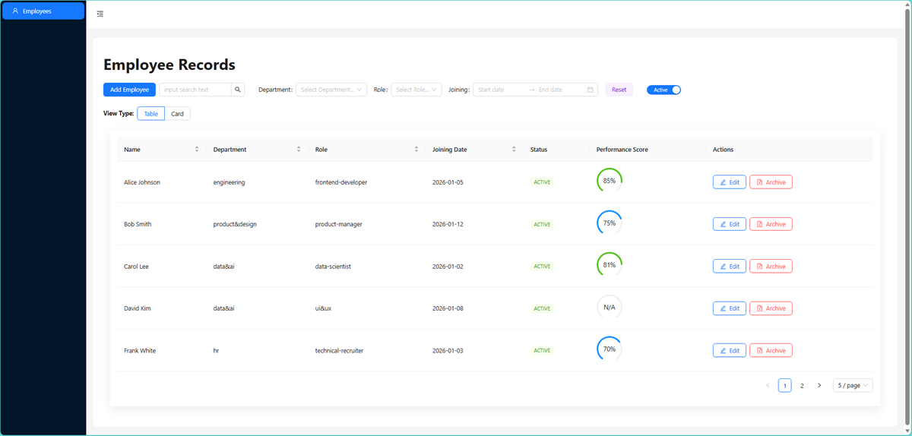
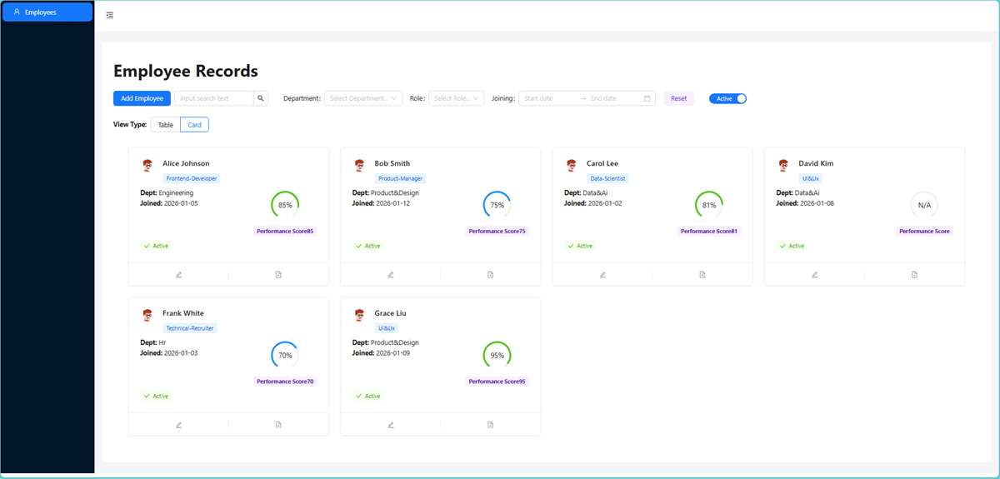
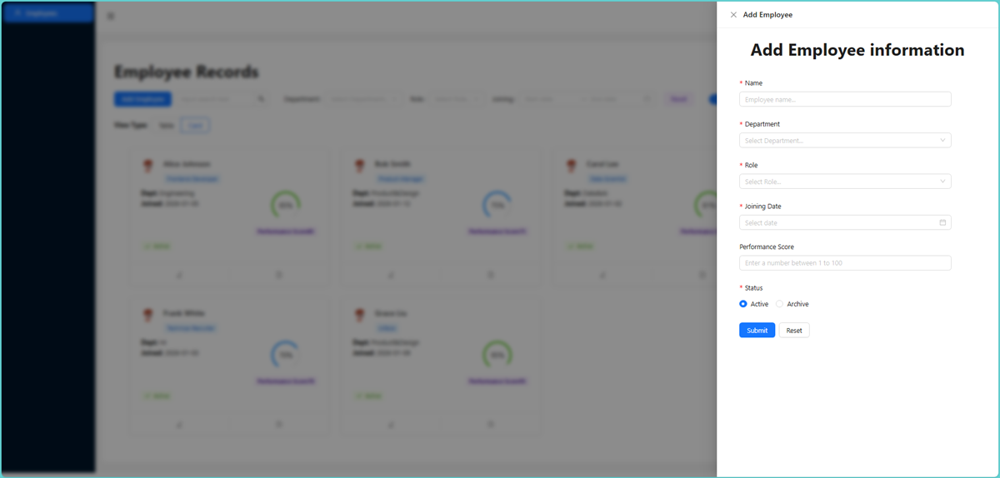
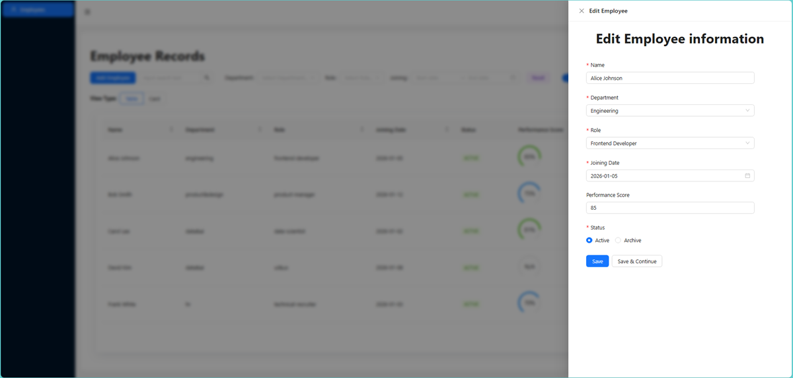
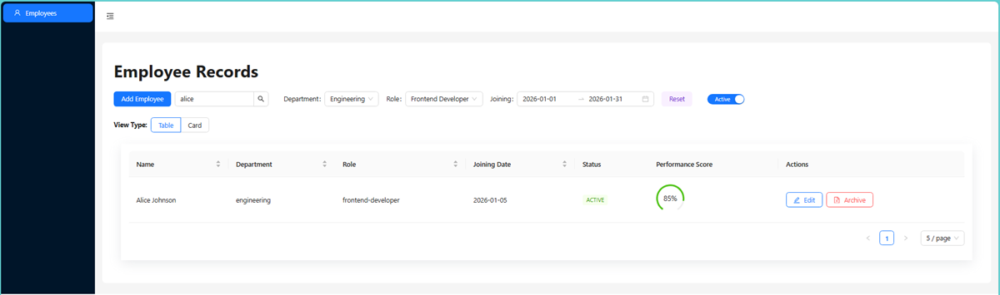

# Employee Dashboard (Interview Task)

A feature-rich **Employee Management Dashboard** built as part of an interview task. The project simulates a real-world admin panel with CRUD operations, persistent storage, advanced search & filtering, and a modern UI using **React**, **Ant Design**, and **Tailwind CSS**.

🔗 **GitHub Repository**: [https://github.com/gitbugd20p/Employee-dashboard-intv-task-OS-ST](https://github.com/gitbugd20p/Employee-dashboard-intv-task-OS-ST)

---

## 🌐 Live Demo

[](https://employee-dashboard-intv-task-os-st.vercel.app/)

🚀 **Deployed on Vercel**  
👉 https://employee-dashboard-intv-task-os-st.vercel.app/

---

## 📸 Screenshots

### 🧾 Employee Table View



### 🗂️ Card View Layout



### ➕ Add Employee Drawer



### ✏️ Edit Employee Drawer



### 🔍 Filter & Search UI



---

## 📌 Project Goal

Enhance a basic employee management system into an **interactive admin dashboard** by implementing:

- Persistent CRUD operations
- Advanced filtering and search
- Responsive UI with multiple views
- Clean UX patterns commonly used in production dashboards

---

## ✨ Implemented Features

### 1️⃣ Full CRUD with Persistent Storage

- Create, Read, Update employees
- Soft delete using **Archived** status
- Data persistence using **localStorage**
- Loading state handled with AntD `<Spin />`

### 2️⃣ Enhanced Edit Flow

- Edit employee using **AntD Drawer** (instead of modal)
- Form pre-filled with existing employee data
- Separate Add & Edit drawers for better UX

### 3️⃣ Soft Delete (Archive)

- Employees are marked as `archived` instead of being removed
- Toggle switch to view **Active / Archived** employees
- Status visually represented using AntD `Tag`

---

## 🔍 Search & Filtering

### 4️⃣ Global Search (Debounced)

- 500ms debounce using `useEffect + setTimeout`
- Searches across:

  - Name
  - Department
  - Role
  - Status

### 5️⃣ Multi-Filter System

- Department filter (Dropdown)
- Role filter (Dropdown)
- Joining date range filter (RangePicker)
- Combined filtering using `useMemo` for performance

---

## 🎨 UI / UX Enhancements

### 6️⃣ Responsive Layout

- **Table View** (default)
- **Card View** (toggle)
- Grid-based responsive card layout

### 7️⃣ Performance Score (Bonus)

- Performance score (1–100)
- Visualized using AntD **Progress (dashboard type)**
- Dynamic color based on score value
  🔴 0-20 | 🟠 21-40 | 🟡 41-60 | 🔵 61-80 | 🟢 81-100

### 8️⃣ Empty State Handling

- Friendly empty state using AntD `<Empty />`
- Call-to-action to add first employee

### 9️⃣ Pagination

- AntD Table built-in pagination
- Items-per-page selector

---

## 🎁 Extra

The following features were implemented beyond the original task requirements to improve usability and reviewer experience:

### 🧪 Preloaded Sample Data (Demo Mode)

- When the app has no employee data, a friendly empty state is shown
- Includes a **“Load Sample Data”** button
- Instantly populates the dashboard with predefined employee records
- Allows reviewers to explore all features without manually adding data
- Uses the same data structure as standard CRUD operations

---

## 🛠️ Tech Stack

### Frontend

- **React 19** (Vite)
- **Ant Design (antd)** – UI components
- **Tailwind CSS** – utility-first styling
- **Day.js** – date handling

### Tooling

- Vite
- ESLint + Prettier
- LocalStorage (for persistence)

---

## 🧠 Core Logic Overview

### Custom Hook – `useEmployees`

Responsibilities:

- Load employee data from localStorage
- Persist updates automatically
- Provide CRUD methods:

  - `addEmployee`
  - `updateEmployee`
  - `archiveEmployee`

### Local Storage Utility

- Centralized helper functions:

  - `loadFromLocalStorage()`
  - `saveToLocalStorage()`
  - `removeFromLocalStorage()`

Ensures clean separation of concerns.

---

## ⚠️ Known Limitations

The following features are **planned but not fully implemented yet**:

### ❌ Sorting (Future Work)

- Sorting UI exists on table columns
- Sorting logic is **not yet functional**
- Sort state persistence via localStorage planned

### ❌ Date Validation

- Joining date can currently select future dates
- Validation rule to block future dates will be added

---

## 🚀 Future Improvements

- ✅ Column sorting with persisted state
- ✅ Prevent future date selection in DatePicker
- 🔄 Mock API integration (JSON Server)
- 🔔 Toast notifications on Add / Edit / Archive
- 🧪 Unit testing for hooks & components
- 🌙 Dark mode toggle
- 📤 Export employee list (CSV / Excel)
- 🔐 Role-based access simulation (Admin / Viewer)

---

## 📂 Project Structure

```text
Employee Dashboard - submitted task
├── src
│   ├── components
│   │   └── employees
│   │       ├── AddEmployeeDrawer.jsx
│   │       ├── EditEmployeeDrawer.jsx
│   │       ├── EmployeeTable.jsx
│   │       └── MultiFilterEmployee.jsx
│   ├── hooks
│   │   └── useEmployees.js
│   ├── pages
│   │   └── Employees.jsx
│   ├── utils
│   │   └── localStorageFc.js
│   ├── assets
│   ├── App.jsx
│   └── main.jsx
├── index.html
└── package.json
```

---

## 🏁 Getting Started

```bash
# Install dependencies
npm install

# Run development server
npm run dev
```

---

## 👤 Author

**Md Sabur**
Junior Frontend Developer (React)

- 🐙 **GitHub**: [https://github.com/gitbugd20p](https://github.com/gitbugd20p)
- 💼 Aspiring **Junior React Developer / Frontend Intern**

---

## 📄 License

This project was created for **interview evaluation purposes** and learning.

---
